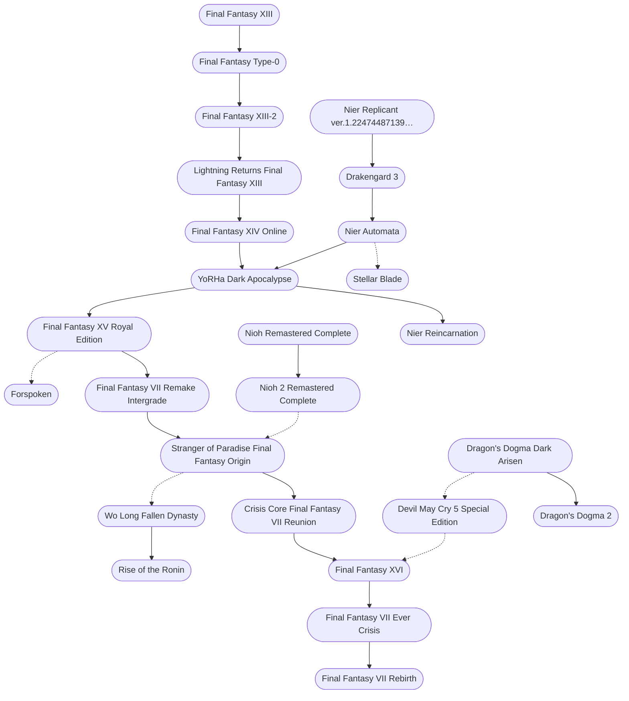

#### Timeline

1. [[Final Fantasy XIII]], 2009-12-17
2. [[Nier Replicant ver.1.22474487139…]], 2010-04-22
3. [[Final Fantasy Type-0]], 2011-10-27
4. [[Final Fantasy XIII-2]], 2011-12-15
5. [[Dragon's Dogma Dark Arisen]], 2013-04-23
6. [[Final Fantasy XIV Online]], 2013-08-27
7. [[Lightning Returns Final Fantasy XIII]], 2013-11-21
8. [[Drakengard 3]], 2013-12-19
9. [[Final Fantasy XV Royal Edition]], 2016-11-29
10. [[Nioh Remastered Complete]], 2017-02-07
11. [[Nier Automata]], 2017-02-23
12. [[Devil May Cry 5 Special Edition]], 2019-03-08
13. [[YoRHa Dark Apocalypse]], 2019-10-29
14. [[Nioh 2 Remastered Complete]], 2020-03-12
15. [[Final Fantasy VII Remake Intergrade]], 2020-04-10
16. [[Nier Reincarnation]], 2021-02-18
17. [[Stranger of Paradise Final Fantasy Origin]], 2022-03-14
18. [[Crisis Core Final Fantasy VII Reunion]], 2022-12-13
19. [[Forspoken]], 2023-01-24
20. [[Wo Long Fallen Dynasty]], 2023-03-03
21. [[Final Fantasy XVI]], 2023-06-22
22. [[Final Fantasy VII Ever Crisis]], 2023-09-07
23. [[Final Fantasy VII Rebirth]], 2024-02-29
24. [[Rise of the Ronin]], 2024-03-22
25. [[Dragon's Dogma 2]], 2024-03-22
26. [[Stellar Blade]], 2024-04-26

 

#### Flowchart

