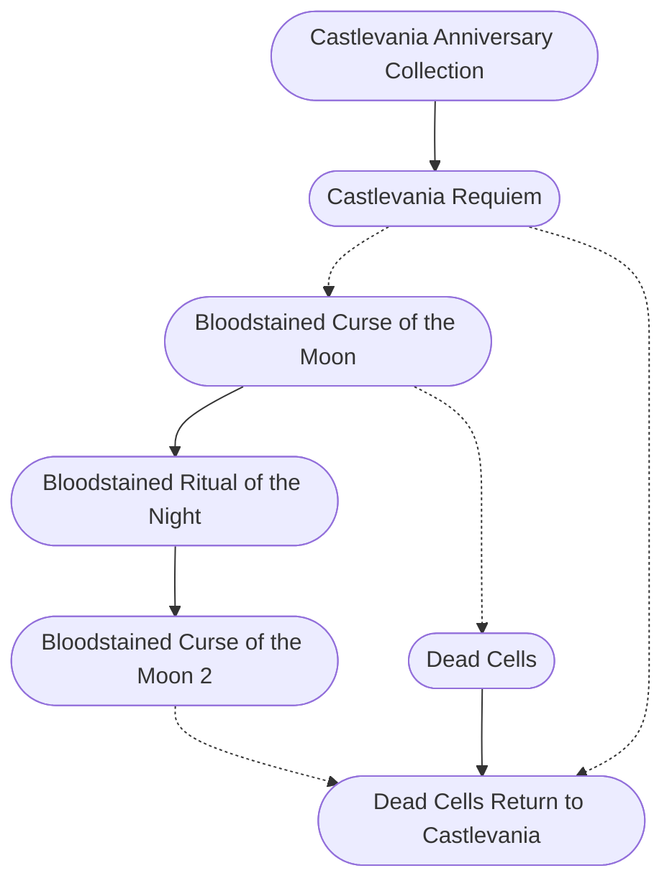

#### Timeline

* [[Castlevania Anniversary Collection]], 2019-05-16
* [[Castlevania Requiem]], 2018-10-26
* [[Bloodstained Curse of the Moon]], 2018-05-24
* [[Dead Cells]], 2018-08-07
* [[Bloodstained Ritual of the Night]], 2019-06-18
* [[Bloodstained Curse of the Moon 2]], 2020-07-10
* [[Dead Cells Return to Castlevania]], 2023-03-06

 

#### Flowchart

