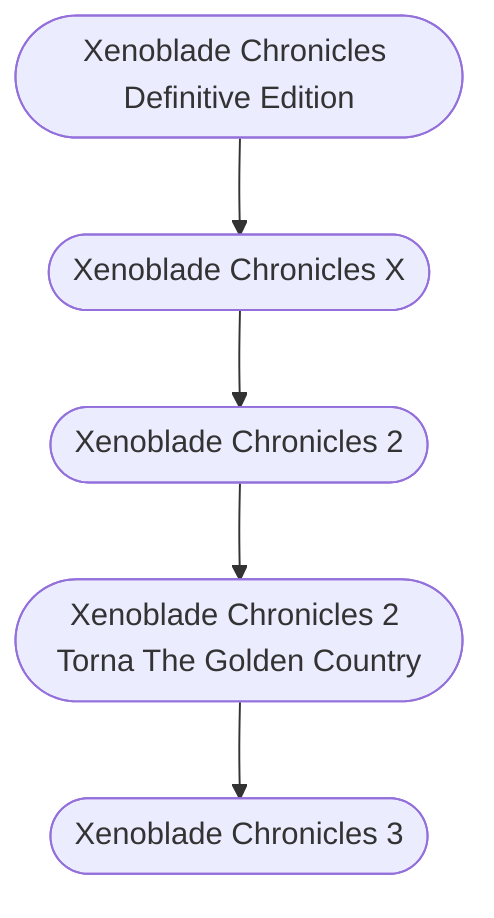

* [[Xenoblade Chronicles Definitive Edition]], 2010-06-10
* [[Xenoblade Chronicles X]], 2015-04-29
* [[Crypt of the NecroDancer]], 2015-08-23
* [[Persona 5 Royal]], 2016-09-15
* [[Breath of the Wild]], 2017-03-03
* [[Xenoblade Chronicles 2]], 2017-12-01
* [[Dynasty Warriors 9]], 2018-02-08
* [[Persona 5 Dancing in Starlight]], 2018-05-24
* [[Xenoblade Chronicles 2 Torna The Golden Country]], 2018-09-14
* [[Cadence of Hyrule]], 2019-06-13
* [[Fire Emblem Three Houses]], 2019-07-26
* [[Persona 5 Strikers]], 2020-02-20
* [[Hyrule Warriors Age of Calamity]], 2020-11-20
* [[Fire Emblem Warriors Three Hopes]], 2022-06-24
* [[Xenoblade Chronicles 3]], 2022-07-29
* [[Tears of the Kingdom]], 2023-05-12
* [[Persona 5 Tactica]], 2023-11-17

 

#### Flowchart

 

 

 

