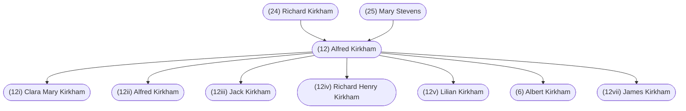

#### Summary

Alfred Kirkham was born on September 19, 1891 in Tipton, Staffordshire, England to [(24) Richard Kirkham](/24-richard-kirkham/) and [(25) Mary Stevens](/25-mary-stevens/).

Alfred was the second of three children. Alfred’s siblings were:

* [(24i) Richard Kirkham](/24i-richard-kirkham/), born April 26, 1888
* [(24iii) Lilian Kirkham](/24iii-lilian-kirkham/), born February 24, 1899

Alfred married [(13) Elsie Holland](/13-elsie-holland/) on June 11, 1916 in Tipton, Staffordshire, England.

They had seven children:

* [(12i) Clara Mary Kirkham](/12i-clara-mary-kirkham/), born April 6, 1917
* (12ii) Alfred Kirkham, born October 1, 1918
* (12iii) Jack Kirkham, born March 4, 1922
* (12iv) Richard Henry Kirkham, born March 23, 1923
* (12v) Lilian Kirkham, born August 8, 1925
* [(6) Albert Kirkham](/6-albert-kirkham/), born July 5, 1928
* (12vii) James Kirkham, born April 1, 1934

Alfred died on January 1, 1979 in Vancouver, British Columbia, Canada and was buried in Mountainview Cemetery, section Jones, block 37, space 1659, Vancouver, British Columbia, Canada.

 

#### Chart

#### Biography

*As written by daughter-in-law [(7) Lorraine Fitzpatrick](/7-h-lorraine-fitzpatrick/) with the help of Alfred’s children [(12ii) Alfred Kirkham](/12ii-alfred-kirkham/), [(12i) Clara Mary Kirkham](/12i-clary-mary-kirkham/), [(12v) Lilian Kirkham](/12v-lilian-kirkham/), and her husband [(6) Albert Kirkham](/6-albert-kirkham), with reference to letters from England received from Dad’s second cousin Francis Albert 'Billy' Kirkham.*

Alfred Kirkham was the second son born September 19, 1891, to Richard Kirkham and Mary Stevens. They were living at his grandfather's home on Church Street, Princes End, Tipton (Coseley), Staffordshire, England. Richard and Mary owned the Black Horse Inn situated in Park Lane, Tipton, operating an adjoining wharf near Buller's factory in partnership with his brother John (Uncle Jack) - J and R Kirkham. As a young boy, age 11, Alfred helped in the brewing of the beer and later, age 14, delivered coal from the wharf with a horse pulling a cart.

Alfred went to the Anglican Church School for boys next door to the Anglican Church School for girls attended by Elsie Holland. He would have liked to have pursued his education but was needed in the business.

When Alfred was nineteen years of age, his mother died of influenza, February 21, 1911. She had held the business together. Without her control, it wasn't long before expenditures exceeded income. The business failed.

A Canadian politician, R. B. Bennett, (became Prime Minister), visited Tipton, England inviting men to emigrate to Canada to work in the coal mines in Nanaimo, B. C. Alfred was at the rally and inspired by the opportunity. When his family heard of his plans, they all wanted to accompany him. They sailed for Canada from Southampton on the S. S. Andania, departing August 21st, 1913, and arrived in Quebec on August 30th, 1913. From Quebec they traveled by rail across Canada to Vancouver and the ferry from Vancouver to Nanaimo on Vancouver Island.

*An immigration office was established in Charing Cross Road that was independent of the High Commissioner’s office. Numbers emigrating to Canada increased. The largest year of all came in 1912-13 when 150,000 Britishers arrived in Canada. Most settlers from Britain came as individuals in search of a better standard of living and in the hope of escaping the rigidities of the British class structure.*[^1]

When Elsie Holland was twenty-one, Alfred gave her a bracelet. He promised he would come back for her. All her family and friends said she would never see him again.

Now in Canada, Alfred was working at South Wellington Mine. Any spare cash he had, he sent to his sweetheart home in England. Elsie used the money to buy all their linens, in preparation for their marriage. Elsie was to come to Canada where they would get married.

The First World War began August 4, 1914. Alfred had sent Elsie the funds for her passage to Canada in the months following and she was booked to sail on the Lusitania. However, Alfred told her not to sail. Too many ships were going down. As it turned out, the Lusitania was sunk May 7, 1915, by a German U-boat off the coast of Ireland.

There was unrest in the Miner's Union (Strikes 1912 - 1914) which made for stressful shifts working. As he heard the news of the war, one can imagine he grew restless. In 1915, Alfred got drunk and when he went to work he was told he was fired. His response was “you can’t fire me. I quit”. He had decided to return to England.

On the day shift on February 19, 1915, one hundred miners were at work. Two hundred yards was believed to separate them from the actual workings of the old flooded mine when the miners blasted through into the old mine. The water rose twenty-five vertical feet or 500 feet on a slope. As they warned men to get out of the mine, a sudden gush of water swallowed them up, sweeping bodies to a higher level along with several heavy coal cars.

His father (Gramp) had left broken family ties when they lost the family business in that period prior to emigrating to Canada in 1913. No one had seen them off to say goodbye. When Alfred arrived in England in July of 1915, he had no money and nowhere to stay. When he went to Elsie and told her his situation, Elsie's mother put Elsie in another room and Alfred had Elsie's room, boarding with them for a short while. Alfred told Elsie that it was his father (Gramp) that had caused the ill will with the Kirkham’s but that he would go and try to make amends with his family, which he did. He went to his Uncle Jack’s and specifically to Aunt Polly and she arranged for him to stay with them at “The Bungalow, Victoria Road, Tipton”. This is his address on their marriage certificate.

Back in England, there was no work. Alfred's cousin Francis Albert (Billy's father), son of his Uncle Jack, was out enjoying himself in the company of Alfred Allen whilst Alfred went to work in the quarries at Ladywood Deepfields looking after the slag works.

Alfred Kirkham and Elsie Holland were married on June 11, 1916, at the Parish Church in Tipton, Staffordshire, England. On the marriage certificate, his occupation states he was a munitions maker. At the end of each shift, on the walk home, Alfred would pick up pieces of coal he collected in a bag over his shoulder. This was enough to keep Elsie warm in the home each day.

Alfred and Elsie had seven living children in all, the first two born in Tipton, Staffordshire, England. Daughter Clara was born April 6th, 1917, and son Alfred (Alfie) on October 1st, 1918. Clara was five months old when Alfred joined the army. He was in the Royal Medical Corp using first-aid skills learned in the mines in Canada. Alfred hated the army and got out of it as soon as he could.

They were crying for coal miners and he went into work on the slag fields. It is not really known what he was doing between 1918-1920 but to return to Canada was a spur of the moment decision. Alfred thought he could do better in Canada, egged on by ‘Gramp’. Elsie was not very happy about going to Canada. She was settled in now as a wife and mother in England. She was pregnant and lost the baby on the journey.

Alfred's father Richard ‘Gramp’ had returned to England departing Canada May 14, 1920 to visit family. His brother Jack had passed away in 1919. Richard lived with Alfred and his family until they all sailed for Canada on the S.S. Victorian September 30th, 1920, arriving in Quebec October 21st, 1920. It was all so foreign to Elsie, cool weather and they didn’t speak English. It was not easy traveling with two children, Clara only three years old, little Alfie just two years old and still in diapers. It took three weeks by rail and ferry from Montreal to Nanaimo their new home. It was now November. Alfred’s brother Richard, working in the piano store in Nanaimo, B. C., funded their passage to Canada. They had to pay Richard back, once they were back to work in Nanaimo.

Elsie was homesick. She felt like a stranger with her British ways so foreign to her Canadian neighbours who made fun of the way they dressed and their accent. She was bothered hanging clothes out on the line for the neighbor ladies to see. One example was calling an undershirt a 'singlet'.

When they arrived in Nanaimo, they were to live temporarily with Alfred's brother Richard (Uncle Dick) and his family on Richard Street, known as “Chicken Alley”. However, prior to their arrival, a neighborhood incident occurred in which Uncle Dick's wife, Aunt Jen, was shot accidentally in the leg by one of the youngsters playing with a gun. The fallout from that is that when Dick and Jen moved to the house they had purchased, 512 Wentworth, the people wouldn't rent the house on Richard Street to the new arrivals Alfred and Elsie. Alfred and Elsie were forced to live sharing the accommodations and expenses of the household on Wentworth which included ‘Gramp’, Dick, Jen and their seven year old son Dickie. Elsie with two small children in this situation found it unbearable. After words with Alfred, she spoke to her brother-in-law Dick saying she would be leaving if a place wasn't found for them to be on their own.

They were able to move to a house on Halliburton Street for a couple of months. From there, they rented a house on 9 Machleary Street. Elsie had been having health problems and more miscarriages. Finally, a doctor told her that her womb was tilted, treated her and soon son Jack was on the way born March 4, 1922. Dick would follow one year later on March 19, 1923.

An example of sayings Alfred had from his roots in England was, "on the train (horsecar), the driver calls out 'Arrington Station'. A passenger tells him that he left the 'H' off Harrington. The driver's reply was - I'll add it on at 'Hoxford Circus'."

Some of Elsie's expressions based on her roots in England are as follows. She would say of son Jim, "He's some 'ninetor', which meant always into something. A baby’s hands were called 'little donnies'. When Elsie asked if a child was potty trained, her question was "is he or she 'clean'?" Being silly was 'acting dannel.' She had three categories for tomatoes - ripes, half-ripes and greens. She never liked to drink water. She would say, 'it makes my belly cold'.

Alfred returned to work in the coalmines at South Wellington, Granby, Extension, Wakesiah and No. 1 Main on the Nanaimo waterfront. He also worked at White Rapids. Alfred had written exams and passed so was qualified as a fire-boss and had his first-aid ticket.

Every day at 5 p.m., a steam whistle blew at the Western Fuel Colliery down at the Nanaimo waterfront. If the whistle blew once, there was work tomorrow. If it blew twice there was no work. Of the population of male workers in Nanaimo at the time, the bulk of them worked in the mine. Their lives hinged on work, affecting the livelihood of Nanaimo as well. If the miners worked, those running the stores also did well. It should be noted that the mine was self-sufficient as it produced its own electricity from coal and also had its own railway.

From Machleary Street, the family moved to 224 Prideaux Street. Son Alf remembers his father having a broken finger, broken at work, and walking to Wakesiah Mine with his father to get his paycheque.

The house at 224 Prideaux Street was built in such a way that it could be divided into separate dwellings - the Kirkham's shared it with Jack and Mary Fellows. Mary was Aunt Jen's sister.

Aunt Jen's proper name was Jane Mallon. The Mallon's were not a wealthy family and had many children. Members of the Mallon family who left England for Canada settling on Vancouver Island were Jane, Mary and Gertrude. Gertrude's (Gertie) married name was Taylor. She had daughters Edith and Muriel. They lived in Comox/Courtney, as did Aunt Jen after Uncle Dick died.

Jack Fellows was from Gornal, England. The Kirkham children called Jack and Mary “aunt” and “uncle”, although they were not relatives. Danny Fellows was born at 224 Prideaux Street. The Fellows family moved to Cumberland where Jack worked in the mines until they returned to England in June 1934.

Daughter Lilian was born to Alfred and Elsie on August 8th, 1925, while living at 224 Prideaux Street. Mrs. Aitken, a midwife, lived next door and this was how Elsie got to know her. At the time, that part of Prideaux Street was the house 224; Mrs. Aitken's house; and on the corner was Malcolm Pearson's Warehouse.

When living at 224 Prideaux Street, ‘Gramp’ shared grandson Alfie's bed whenever his employment didn't provide housing. Room and board did not come with the job when he first went to work at the Windsor Hotel in 1927. ‘Gramp’ moved with the family to 151 Prideaux Street. Son Albert (Bert) was born to Alfred and Elsie at this address, July 5th, 1928.

In 1929, ‘Gramp’ loaned son Alfred $1100.00 to purchase the property at 108 Prideaux Street, preparing for the day when he would retire. The house with the cottage at the rear of the property was a good investment to house the family and he would have separate accommodation for himself. The purchase price was $1300.00 but ‘Gramp’ offered owner Mrs. Elsie Jenard $1100.00 cash and she took it. Alfred and Elsie paid the debt back to ‘Gramp’ at $15.00 per month.

It was at Protection Mine under Protection Island where son Alfie at age eighteen (1936) joined Alfred working in coal mining for a period of approximately eighteen months, until August of 1938. To Protection Mine they were ferried over to Protection Island on a scow named "We Two" and taken down the shaft to walk about two miles under the sea towards Snake Island. There were two seams - the Douglas Seam and the Newcastle Seam. When you got down the shaft you either went left or right depending on whether you were working at Protection Mine or Puywallup. You walked to the tramway having stopped by the underground barn to get your mule. Alfie was a winch kid earning $1.78 per day; Alfred was a fire-boss earning $6.00 per day. Alfred very often worked overtime but at the same rate of pay. Alf, the son, remembers his father telling him there was a layer of coal fifty feet thick that would never be taken out of this area. The pressure effect would cause the coal to burst into fire so it was not possible to mine it.

Alfred was injured on the job around 1950 when he was crushed between two coal cars. One coal car let go and he was hit between the two cars. His comment when it happened was, “you got me this time”. He suffered a broken pelvis although it would have been much worse had he been thin.

In later years, Alfred had tried working an abandoned coalmine with a couple of other men but this did not seem to work out. He also worked in a sawmill sorting lumber off the green chain. He was in his sixties at this time and had no pension from Canadian Collieries. Sawmill work was too hard for him. Alfred was then employed as a gateman working for McMillan and Bloedel, just south of Nanaimo at the Harmac Pulp Mill and later wrote the Industrial First-Aid Course becoming a first-aid man. He worked at Harmac until he retired at the age of sixty-seven.

In the confines of the coalmine, Alfred worked with men from Yugoslavia, Italy and Poland. His son Alf used to say they "spoke garlic".

As the children grew up, Elsie made sure they attended Sunday School. The older boys didn't always co-operate, their boots were covered in mud from play all morning at Billy Ritchie's farm. With Sunday School at St. Paul’s Anglican Church at 2.30 p.m., she tried to dry them at the stove, putting on polish, but had no luck getting the shoes to shine. There was always pieces of wire behind the kitchen stove to dry heavy clothing during the winter. ‘Gramp’ worked at the Windsor Hotel across the street from both the church and candy store the family called 'Peanut Johnny's'. Occasionally, ‘Gramp’ gave the children a nickel soon spent at the store.

With a family of seven children, Elsie's work was never done. The appliances we are so used to today were not available then, and meant the work was not easy. The kitchen stove burned coal and wood, mostly coal, to heat the home and to do the cooking. With Alfred a miner, he was able to purchase coal for $3.00 a ton. The coal and wood had to be brought up from the basement. Son Jack cut the kindling used to start the fire and sons Alf and Dick brought it upstairs. A coal and wood heater heated the living room.

The washing was done scrubbing clothes clean on a scrub-board in an oblong metal boiler. Clothes were dried outside on a clothesline or on rainy days on an indoor pull-up line. Also, pieces of wire line behind the kitchen stove were used to dry heavy clothing, mitts, etc. during the winter. A door-to-door salesman came to Elsie's door from downtown one day between l932 and l934 and from him she purchased a wringer washing machine for $5.00 down and $5.00 per month. The salesman came one evening to demonstrate taking the dry clothes from the line showing Elsie how she could use the wringer like an iron. It wasn't satisfactory for all clothing. In l935, son Alf did all the washing for his mother for many months when she suffered Erysipelas. Son Alf fixed the machine through the years until in 1940 when he was employed at Beatty Bros. and purchased a new washer for a good price, again $5.00 down.

Although there was always running water in the home, it was some time before the flush toilet outside was replaced with an indoor bathroom.

In those days, refrigeration wasn't a necessity. Milk was delivered to homes every day by horse and wagon, both in the morning and the afternoon. Elsie ordered her meat each day from the butcher Tommy Cannon. Son Jack, and then son Dick, worked for him and brought what their mother ordered home with them. The weekend roast cost $1.25 and sausages cost $ .25. Elsie asked for 'undermeat' for Alfred – tenderloin it being a T-bone roast of beef or filet of veal roast as he always wanted the top cut of meat. ‘Gramp’ bought the joint every second Sunday when he was off work and joined the family for dinner around l2.30 p.m. In later years, perishable food was kept cool in an icebox. Bert remembers the butter running because the ice had melted in hot summer weather. In 1951, Elsie returned from a trip to England to find a new refrigerator in her kitchen. Son Alf had purchased it at Goth and Co. in Vancouver and had it shipped over to Nanaimo. Elsie’s reaction was that she would rather have a new chesterfield suite but later on she realized how useful a fridge was as she could buy perishables in advance instead of shopping every day to say nothing of the end of the waste, especially of cold meat.

After the war, when son Alf was working in Vancouver, he purchased a second hand furnace for $50.00 to install in Alfred and Elsie's Nanaimo home. Son Dick had some experience in furnace installation and he put all the ductwork in the house after Alf installed the furnace.

Many years later, son Alf rewired the entire house and cottage and he installed a steel furnace with a blower and an electric stove purchased for $25.00 from his wife Eleanor's Auntie Kay. Son Dick had an electric side-burner in the basement of his Vancouver home and brought it over to install with the new stove. Alfred and Elsie no longer had to worry about coal and wood.

108 Prideaux Street only had three bedrooms. At one time, the four boys slept in one room. Alf and Dick in one bed. Jack and Bert in another bed. When Jim was born April 1st, 1934, he slept in with his parents and then Alfred built a large crib for Jim and he slept in the same room as Clara and Lil in their bedroom off the kitchen. Later, Dick slept in the cottage with ‘Gramp’; in the middle bedroom, Alf occupied the one bed and Jack and Bert shared the other. Bert spent three years in the Queen Alexandra Solarium at Cobble Hill, when he had rheumatic fever. By the time he returned home, both Jack and Dick had gone to war leaving Bert and Jim sharing the bed in the same room as Alf. Bert loved to take his stinky socks into the bed and bringing them out from under the covers, tease little brother Jim by rubbing them in his face.

One of the many sayings we heard over and over again gathered with the family at the folks house on Friday evenings in Vancouver was "apple core, Baltimore, whose your friend?” and whoever was named, the apple was thrown at him.

It is well known Alfred's favorite "watering hole" in Nanaimo was the Occidental Hotel where some would say he spent too much of his time. He never owned a car. Everyone walked to where they were going. Alfred never went back to England after bringing his wife and family to Canada in 1920, however, Elsie sailed to England in 1951 and Elsie and Clara went to England together in 1956 sailing on the Empress of Britain.

In Alfred's retired years he was an avid lawn-bowler belonging to Nanaimo Bowling Club. He made several trips to Vancouver and Victoria lawn bowling in tournaments. Son Bert remembers on one trip to Vancouver, he helped his father get outfitted in a new suit at Arnold and Quigley on Granville Street - size 42 stout.

As the family grew up, one by one, they eventually moved from Nanaimo to find work. On November 5, 1961, Alfred, when walking at the side of the road, was hit by a car. He was hospitalized, bruised from head to toe, but nothing was broken. Not long after this accident, the wheels were put in motion to move Alfred and Elsie over to Vancouver to be closer to their children. The house in Nanaimo was sold and they moved to a house in Vancouver - 1908 West 42nd Avenue - across the lane from son Alf.

Elsie's heart was giving her trouble just prior to the move. She was working too hard preparing to move and had walked home from town carrying too many parcels. She was admitted to the Nanaimo Hospital. Alfred went to Vancouver in April followed by Elsie in July 1964. As it turned out, when the folks were moving to Vancouver, son Jack and his family, living in North Vancouver, would be posted with the pilotage to Victoria on Vancouver Island.

Alfred and Elsie enjoyed frequent visits from all the families. Friday evening visits were traditional when the Vancouver families stopped in after shopping at Oakridge. They became named the "Jolly Hour" by granddaughter Joanne. An appropriate name if you ask anyone who arrived later. They would smile coming up the street listening to the sound of laughter coming from the house. All the grandchildren remember the bottomless candy bowl and dishes of cheezies and chips.

Alfred and Elsie celebrated their 50th Wedding Anniversary in June 1966.

Christmas celebrations varied, however, it would be safe to say that for a number of years there was Christmas Eve dinner at Alfred and Elsie’s, attended by all family members in the city of Vancouver. As was the case relative to the Friday evening gatherings, it was delightful when those from out of town such as Jack and June or the Kamloops families arrived in time for the festivities.

Like his father before him, Alfred could recite poetry learned through the years. In 1972, Christmas was at Bert’s home and Lorraine had set up the tape recorder in the hope there would again be some recitation. We were not disappointed and one favorite recited and taken from the tape is the following:

*Tale of the Scolding Wife*

> “A friend of mine was married to a scold,
 And to me, all his troubles told.
 Said He, she’s like a woman raving mad;
 Said I, alas my friend, that’s very bad.
 Oh, not so bad said He.
 For with the troth she had a house, with land, and money too.
 Well, that was not so bad said I;
 Oh, not so good said He,
 For I went alol with her own brother;
 I the suit lost, and every penny went to pay the cost.
 Oh, that was bad said I;
 Oh, not so bad said He,
 For He did agree that I the house should keep,
 and He give to me four score of Yorkshire sheep,
 all fat and fine and fair they were to be.
 Well, that was not so bad said I;
 Oh, not so good said He,
 For they everyone died of the rot.
 Oh, that was bad said I;
 Oh, not so bad said He,
 For I had sense to scrape the fat and melt
 the tallow and put away for winter store.
 Then said I, that was better than before.
 Oh, not so well said He,
 For having a careless fellow to scrape
 the fat and melt the tallow
 Like brimstone and matches, the fire catches
 and burns my house right down to ashes.
 Oh, that was bad said I;
 He says, not so bad said He,
 For what was best, my scolding wife
 was burnt amongst the rest.”

When he recited this verse, he of course did it with the old English speech, and therefore when he said, “not so bad said He”, he said it “not so bad said ‘E’”. The ‘H’ was always dropped.

Alfred and Elsie celebrated their 60th Wedding Anniversary June 11th, 1976.

Alfred died on January 1, 1979 in Vancouver General Hospital, Vancouver, B. C., after a few months of poor health. On July 11, 1986, Elsie was getting dressed in her home in the morning and died suddenly of a ruptured aneurysm. Alfred was cremated.

Elsie was buried at Mountainview Cemetery, Vancouver, B.C. and when son Dick died, daughter Clara had Alfred and Dick’s ashes put in the family grave with a new gravestone made to include the three names. After daughter Clara died in 2001, her ashes were also interred in the gravesite and her name added to the gravestone.

The gravesite is located Block 37, Section Jone’s 2, Grave space 1659, Mountainview Cemetery, Vancouver. J. B. Newell made the plaque.

Note: *NANAIMO* - In 1860 about 1,000 coal miners and their families were jammed into tiny bachelor cabins. But when Vancouver Coal Mining and Land Co. bought out the Hudson’s Bay Company interests in 1862, British architect George Deverill was hired to plan a model city on the site.

He took advantage of the existing topography to design a fan-shaped pattern of downtown streets which radiated out from the harbour to the main business area. The east-west roads were designed to lead the eye down to the harbour and behind it to the beautiful panorma of islands, ocean and the distant mainland peaks.

The squared timbers of the gleaming white Bastion, standing guard over the harbour, were shaped for the fur traders in 1853 by Jean-Baptiste Fortier and Leon Labine, a couple of French-Canadian master axe men.

 

#### Notes

[^1]: Page 57 Chapter 4 - Opening Up The Land Of Opportunity - *Canada 1896 - 1921: A Nation Transformed*, Robert Craig Brown and Ramsay Cook
