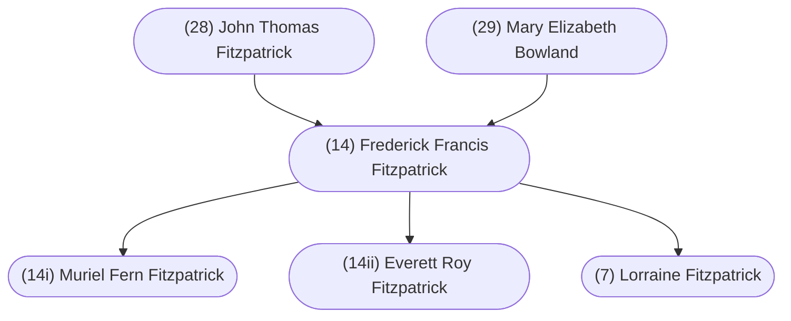

#### Summary

Frederick Francis Fitzpatrick was born on July 14, 1901 in Saint John, New Brunswick, Canada to [(28) John Thomas Fitzpatrick](/28-john-thomas-fitzpatrick/) and [(29) Mary Elizabeth Bowland](/29-mary-elizabeth-bowland).

Fred was the fourth of eight children. Fred’s siblings were:

* [(28i) Jessie Maitland Fitzpatrick](/28i-jessie-maitland-fitzpatrick/), born September 16, 1895
* [(28ii) Annie Catherine Fitzpatrick](/28ii-annie-catherine-fitzpatrick/), born November 3, 1896
* [(28iii) Mary Muriel Fitzpatrick](/28iii-mary-muriel-fitzpatrick/), born February 4, 1899
* [(28v) Gordon William Fitzpatrick](/28v-gordon-william-fitzpatrick/), born October 31, 1904
* [(28vi) Dorothy Jean Fitzpatrick](/28vi-dorothy-jean-fitzpatrick/), born October 11, 1908
* [(28vii) John Harold Fitzpatrick](/28vii-john-harold-fitzpatrick/), born August 30, 1912
* [(28viii) Audrey Heloise Fitzpatrick](/28viii-audrey-heloise-fitzpatrick/), born May 13, 1914

Fred married (15) Vena Sarah Ann Lougheed on March 6, 1923 in Calgary, Alberta, Canada.

They had three children:

* (14i) Muriel Fern Fitzpatrick, born April 19, 1924
* (14ii) Everett Roy Fitzpatrick], born April 6, 1926
* [(7) Lorraine Fitzpatrick](/7-h-lorraine-fitzpatrick/), born December 30, 1939

Fred died on April 27, 1974 in Calgary, Alberta, Canada and was buried in Mountainview Gardens, Calgary, Alberta, Canada.

 

#### Chart

 

#### Biography

*Written by [(7) Lorraine Fitzpatrick](/7-h-lorraine-fitzpatrick/).*

Frederick Francis Fitzpatrick was the fourth child and first son, born to [(28) John Thomas Fitzpatrick](/28-john-thomas-fitzpatrick/) and [(29) Mary Elizabeth Bowland](/29-mary-elizabeth-bowland/), on July 14th, 1901, in Saint John, New Brunswick.

It was not easy raising a family in the Maritimes and Fred’s father found it necessary to commute to Boston, Mass. by rail each week, returning to the family on weekends. It was easier for those of Irish descent to find employment in the United States, particularly in the Boston area, flooded with Irish immigrants. So great in number, native Bostonians felt the threat of being outnumbered. Fred’s mother took in laundry to make extra money to help raise their growing family. Sisters [(28i) Jessie Maitland Fitzpatrick](/28i-jessie-maitland-fitzpatrick/) and [(28ii) Annie Catherine Fitzpatrick](/28ii-annie-catherine-fitzpatrick/) as well as Fred, remembered their mother working so hard and, in spite of her efforts, many days they had only brown bread and molasses for dinner.

Fred played the bugle as a young man, carrying the mouthpiece in his pocket to blow on frequently, in his effort to toughen up his lip. The family was raised in their mother’s church, Saint James Anglican on Broad Street. Their father’s church next door was St. John the Baptist Roman Catholic Church. They walked down the hill together as a family on Sunday morning, their father going to mass and the children with their mother to their service. It was at Saint James where Fred played the bugle and was confirmed on April 22, 1917, Rev. H. A. Cody.

Fred attended King Edward School in Saint John, N. B., completing the sixth grade. He went on to further his education for two seasons at night classes, however, he found it too much with long hours at work. Fred worked for five years at the James Pender Nail Works; as a stableman and driver of the Ford delivery car at Emery Bros.; at Ganongs Confectionery; at a wrapping and paper firm until 1920 and lastly as a ladies hatter.

Fred joined the Dominion L. O. L. No. 141 Orange Lodge, which was a great disappointment to his Catholic father. He received a letter dated 1922 which states that March 21st will be the last meeting of the above named lodge, term ending when the lodge books must be closed.

It must be around that time that Fred with his friend Bob Elliott, set off for greener pastures and headed for western Canada. Fred’s sister Maitland with her husband Frank Ashley were already living in Calgary, Alberta. Fred and Bob arrived in Calgary, and while sitting on the bank overlooking the city from Crescent Heights, with one loaf of bread and five cents to their names, discussed what they hoped to make of their lives. Bob made the statement that he was going to become a millionaire. He didn’t stay in Calgary. Instead, he returned east and to Boston where he walked the streets carrying a pail, etc. and cleaned windows, at first to survive. However, it wasn’t long before he was cleaning the windows of high-rise office buildings employing several people. Bob and his wife Janet visited Calgary in 1952. Fred received a phone call from Bob inviting him and his family to join them at the Banff Springs Hotel, all expenses paid. Fred and (15) Vena Sarah Ann Lougheed, including twelve year old daughter Lorraine, spent a weekend that is in Lorraine’s memory forever. Yes, Bob Elliott did become a millionaire.

Fred’s sister Annie was also living in Calgary, working at Woolworth’s. Annie was having a masquerade party around Halloween and she invited Vena Lougheed, her friend at work. Fred was at the party and was immediately attracted to Vena. There were skating parties throughout the winter. Elmer Mack was sweet on Vena and Fred dated a girl named Laura, but it was Fred and Vena that became the couple.

They were married in Calgary on March 23, 1923. They started married life living at the home of Vena’s parents. A daughter Muriel Fern Fitzpatrick was born April 19, 1924. Their son Everett Roy Fitzpatrickwas born April 6, 1926.

Through the depression years, it was a struggle to keep steady employment. Fred and brother-in-law Ivan Lougheed, worked on cars at a garage on 17th Avenue S. W. At one time, Fred had his own cartage company, Adanac Cartage, between Calgary and Cochrane. In 1926, he was agent for Union Oil Co. Banff, with their home in Field, B. C. When barrels of oil didn’t arrive by rail, Fred drove an oil truck to Calgary to pick them up. One trip back from Calgary, coming down the hill into Field, he lost the brakes on the truck. Vena had been very unhappy living in the mountains, and this incident was the last straw for Fred. He decided to resign and the family returned to Calgary, Fred without work.

In those days, because of the depression, men went on relief performing work for the city for an allowance be it sweeping streets or whatever. Fred hauled bricks to a site in the Elbow River area of Calgary where a brick school was built. Soon through Fred’s father-in-law’s connections, Fred was hired as a night janitor at the Maclean Block where Robert Lougheed managed the building. Fred worked at this job until he left for overseas in 1939.

The family had been renting a house in the district of Sunnyside in Calgary near where sister Maitland and family lived. Son Everett was around four years old (1931) when they moved to 2226 - 27th Ave. S. W. At first they rented the house for $8.00 per month, however, the owner was unable to pay his mortgage on the house. Fred and Vena purchased it for $800.00 with money they had saved, and lived in the house until 1948.

Because of the depression and the hope promised by [William Aberhart](https://en.wikipedia.org/wiki/William_Aberhart "William Aberhart, also known as ‘Bible Bill’ for his outspoken Baptist views, was a Canadian politician and the seventh premier of Alberta from 1935 to his death in 1943. He was the founder and first leader of the Alberta Social Credit Party, which believed the Great Depression was caused by ordinary people not having enough to spend. Therefore, Aberhart argued that the government should give each Albertan $25 per month to spend to stimulate the economy, by providing needed purchasing power to allow needy customers to buy from waiting businesses.") and his stand for [Social Credit](https://en.wikipedia.org/wiki/Alberta_Social_Credit_Party "Alberta Social Credit was a provincial political party in Alberta, Canada, that was founded on social credit monetary policy put forward by Clifford Hugh Douglas and on conservative Christian social values. The Canadian social credit movement was largely an out-growth of Alberta Social Credit. The Social Credit Party of Canada was strongest in Alberta, before developing a base in Quebec when Réal Caouette agreed to merge his Ralliement créditiste movement into the federal party. The British Columbia Social Credit Party formed the government for many years in neighbouring British Columbia, although this was effectively a coalition of centre-right forces in the province that had no interest in social credit monetary policies."), Fred became political, even giving a speech at one of the Social Credit rallies. He wasn’t alone. Social Credit came to power in the Province of Alberta in 1935 and was in power for thirty-five years.

Fred shocked his family when he enlisted in the Dental Corp. of the armed forces on November 2, 1939. Perhaps it was the fact they were expecting their third child that influenced his actions. He told Vena she would be looked after better than ever before, should anything happen to him. This certainly proved correct after Fred passed away in 1974 and the way the Department of Veteran’s Affairs took care of all of Vena’s medical needs for the rest of her days.

He left Calgary December 14, 1939, by rail across Canada. In Winnipeg, the commanding officer found out Fred’s age and that his wife was expecting anytime. He wanted to send him back to Calgary saying he could catch up with the regiment in England but Fred said “No. I’ll carry on.” They sailed from Halifax with the Second Division.

Muriel was in her sixteenth year and Everett in his fourteenth year when their father left for the United Kingdom. Helen Lorraine was born December 30, 1939, which probably coincided with Fred’s arrival in Scotland December 31st, if you consider the time difference. Muriel and Everett would always remember the emotion of watching the back of their mother carrying a small suitcase up the front walk to get into the taxi to take her to the hospital to have their baby sister.

Vena and her children listened to the radio each evening for news from overseas. No one will ever know their pain through those years.

However, their daddy did come home and earlier than some, arriving in Calgary June 26, 1944. Fred contracted polio while in Italy. He was in and out of sickbay until he was discharged on disability pension. The Second World War ended in 1945.

When Fred came home from war, daughter Lorraine was to meet her father for the first time. Although her mother had shown her pictures of him, a man in uniform was not someone she welcomed after her experiences on the streetcar watching the soldier’s poor behavior.

Fred gained experience in the army Dental Corp while overseas and with the help of the Veteran’s Affairs established a thriving business in Calgary operating Acadia Dental Lab. Word spread all over Alberta that Fred Fitzpatrick was the man to get to make dentures, perfectionist that he was. It is safe to say he made dentures for half of Golden, B. C. and for many Hutterite Colonies.

Licensing rules changed after time that required qualifications it was not possible for Fred to achieve. He closed the business and went to work for ten years at the Department of Veteran Affairs, until he retired. After retirement, between the years of 1957 and 1966, he worked part-time for the Canadian Corps of Commissionaires. The first commissionaire organization started in the United Kingdom for the support of returning soldiers from the Crimean War against Russia in 1856. In Canada, it wasn’t until the mid 1920’s that the commissionaires were established in Montreal and gradually expanded across the country. At his leisure, Fred continued to make dentures for family and close friends in his shop in his home.

Prior to the construction of the Glenbow Museum in downtown Calgary, Fred was Caretaker for Glenbow Holdings. Oilman and Senator Harvie had been a collector of fine paintings and valuable collectibles throughout his life. He found it necessary to find a place to store everything and purchased a two-storey house on 13th Ave and 2nd St. S. W. Fred was the caretaker of the contents from 1960 to 1962, respecting each piece as though they were his own.

Daughter Muriel met her future husband Jack Patterson when he was based in Calgary with the R.C.A.F. stationed at #2 Wireless School. The war ended and by 1946, Jack had secured steady employment with Bell Telephone Company. Muriel left Calgary to be married in Toronto, May 17, 1947. Sister Lorraine, age 7, asked why Muriel was leaving. Her mother told her because Muriel had fallen in love. Lorraine’s response was “I aren’t going to fall in love are I?” Vena and Lorraine traveled by rail on the C.P.R. to visit Toronto the following year, staying one month. Muriel and her son Dale, born in 1949, visited Calgary every couple of years. The first family trip west was in 1954. Fred always went on to see his relatives in New Brunswick when he made the trip east.

Fred loved to tease. The more serious the personality, the more he felt mischievous. Niece Wilda, a good looking girl, walked tall and straight dressed in her best suit unaware that Uncle Fred had fastened a clothespin to the back of her jacket. As she walked out the front walk, he stood in the house watching and snickering away until she’d feel something was wrong, turn back to see him laughing and brush at her jacket sure something was up. Once she found the clothespin she'd exclaim, "Oh Uncle Fred,” loving every minute of it.

Brother [(28vii) John Harold Fitzpatrick](/28vii-john-harold-fitzpatrick)’s household called him ‘Freddie Fitz.’ Niece Marilyn remembers being newly married and living close to Uncle Fred and Aunt Vena near Riley Park in Calgary. Marilyn went over to visit and they both walked around the garden with Marilyn, having a nice talk.

Marilyn remembers how very kind and sweet Aunt Vena was. Vena always had such a big smile. One time Delores and Marilyn were over visiting their aunt and uncle and cousin Lorraine had a dresser drawer full of candy. Aunt Vena was angry with her daughter Lorraine because she wouldn’t share with her cousins.

Marilyn has never forgotten Aunt Vena’s cake squares. She says they were like chocolate bars. One kind had a wonderful lemon taste to the icing. Marilyn has nice memories of walking to Uncle Fred’s house, with her can of tomato soup, and Aunt Vena fixing her lunch. Marilyn says, “in the winter or anytime, Aunt Vena’s kitchen was so comfy.”

Marilyn’s sister Gayle became a hairdresser and lovingly, once Vena’s multiple sclerosis began to take its toll, did Aunt Vena’s hair for her, at Vena’s house.

Dale Ernest Patterson was Fred and Vena’s first grandchild. Oh how the tears flowed when a visit ended and they said goodbye to return to Toronto. It didn’t matter that he put the first scratch on Grandma’s new fridge.

Muriel and Jack were the proud parents of a baby girl, Shari-Lynn, born in 1965. A sister for sixteen year old brother Dale.

Son Everett married Annette Szott in 1951 and continued to reside in Calgary. Through the years, it was pure joy for Vena and Fred with almost daily visits from his growing family. Gary Frederick was born in 1952 and his Grandma Fitzpatrick, when nothing else would work, could put him to sleep by singing ‘how much is the doggie in the window.” Grandpa Fitzpatrick gave all the grandchildren their first taste of hot dog mustard; just a speck to see the reaction.

Everett, his wife Annette with baby Gary, traveled east to pick up a new car in 1952 and visited Muriel’s family. They would add Judy to their family in 1953 and Roy in 1957.

Daughter Lorraine had been transferred to Vancouver working for the C.P.R. There she met her future husband. [(6) Albert Kirkham](/6-albert-kirkham/) and Lorraine were married in Vancouver in 1961. Their son Robert was born in 1962, followed by the birth of daughter Lynette in 1964.

Fred and Vena had to face probably one of the greatest hurdles of their lives when Vena was diagnosed with multiple sclerosis. Fred cared for Vena through the many years when her mobility deteriorated until in 1965, Vena flew to Lorraine and family in Vancouver where she spent one happy year. Fred visited frequently but felt their base in Calgary should be maintained. When more care was needed, Fred and Everett met Vena's plane as it arrived from Vancouver and arrangements had been made for Vena to go to Sarcee Auxiliary Hospital.

Fred died April 27, 1974 of a ruptured aneurysm. Vena died July 16, 1978. They are buried in Mountainview Gardens in Calgary, Alberta.
