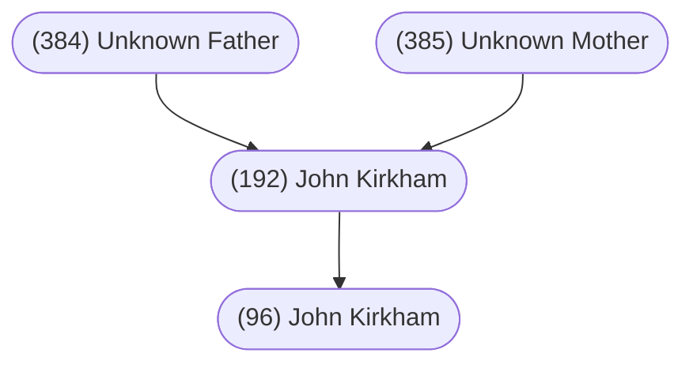

#### Summary

John Kirkham was born on an unknown date in an unknown location to [[(384) Unknown Kirkham]] and [[(385) Unknown Spouse]].

John was the first of at least two children. John’s siblings were:

* Joseph Kirkham, born unknown date

John married [[(193) Sarah Hawkes]] on February 15, 1795 in Sedgley, Staffordshire, England.

They had at least 1 child:

* [[(96) John Kirkham]], born January 1, 1970

John died on an unknown date in an unknown location and was buried in an unknown cemetery.

 

#### Chart

 

#### Biography

*Written by [[(7) Lorraine Fitzpatrick]].*

John Kirkham and [[(193) Sarah Hawkes]] were married February 15, 1795. Witness to the marriage was a Richard - brother?

John was a miner and they lived at Wallbrook, Staffordshire in England, without records, which may have been held at “Chapel of Ease” at All Saints Church, Sedgeley, Staffordshire.  There is not any other information on this family.

John had a brother [[Joseph Kirkham]] married to [[Mary Bowers]], June 4, 1804. They lived at Wallbrook, Staffordshire in England.

John Kirkham and Sarah Hawks had a son name [[(96) John Kirkham]] who married [[(97) Ann Kinsey]] at Sedgley, Staffordshire, England on May 13, 1825.

The children of John and Ann, that we have knowledge of, were sons Samuel, Joseph, Richard (our Gramp’s father), John and daughters Susanna and Jane.

* [[(48) Richard Kirkham]] married [[(49) Sarah Wherton]]
* Their son [[(24) Richard Kirkham]] married [[(25) Mary Stevens]]
* Their son [[(12) Alfred Kirkham]] married [[(13) Elsie Holland]]

This family history is made for the descendants of Alfred and Elsie Kirkham.

The material from Britain was researched by [[Francis Albert 'Billy' Kirkham]]. Edited by Lorraine (Fitzpatrick) Kirkham.

The Canadian story written by Lorraine after interviewing individual family members.
