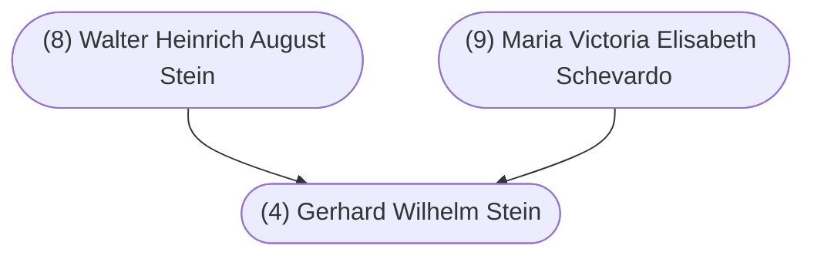

#### Summary

Gerhard Wilhelm Stein was born on September 1, 1931 in Bonn, North Rhine-Westphalia, Germany to (8) Walter Heinrich August Stein and (9) Maria Victoria Elisabeth Schevardo.

Gary was the fourth of five children. Gary’s siblings were:

* Margarete Ferdinande Stein, born October 10, 1924
* Dorethea Wilhelmine Stein, born June 6, 1926
* Walter Jakob Stein, born January 3, 1928
* Rudolf Clements Stein, born October 9, 1933

Gary married [(5) Barbara Maria Stella Ward](/5-barbara-maria-stella-ward/) on June 17, 1961 in Calgary, Alberta, Canada.

 

#### Chart

