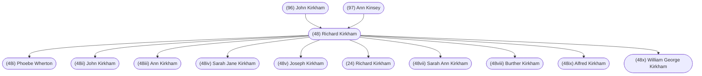

#### Summary

Richard Kirkham was born on April 28, 1831 in Sedgley, Staffordshire, England to [[(96) John Kirkham]] and [[(97) Ann Kinsey]].

Richard was the third of six children. Richard’s siblings were:

* [[(96i) Samuel Kirkham]], born 1826
* [[(96ii) Joseph Kirkham]], born 1830
* [[(96iv) Jane Kirkham]], born 1836
* [[(96v) Susanna Kirkham]], born 1836
* [[(96vi) John Kirkham]], born 1838

Richard married [[(49) Sarah Wherton]] on December 25, 1852 in Dudley, Staffordshire, England.

They had eight children:

* [[(48i) Phoebe Wherton]], born January 6, 1852
* [[(48ii) John Kirkham]], born December 30, 1853
* [[(48iii) Ann Kirkham]], born June 26, 1856
* [[(48iv) Sarah Jane Kirkham]], born November 16, 1858
* [[(48v) Joseph Kirkham]], born June 4, 1861
* [[(24) Richard Kirkham]], born June 4, 1863
* [[(48vii) Sarah Ann Kirkham]], born February 20, 1866
* [[(48viii) Burther Kirkham]], born March 29, 1868

After Sarah died, Richard married [[Elizabeth Rogers]] on May 9, 1869 in Coseley, Staffordshire.

They had two children:

* [[(48ix) Alfred Kirkham ]], born November 27, 1870
* [[(48x) William George Kirkham]], born November 8, 1873

Richard died on March 18, 1897 in Tipton, Staffordshire, England and was buried in Tipton, Staffordshire, England.

 

#### Chart

 

#### Biography

*Written by [[(7) Lorraine Fitzpatrick]] after careful reading of letters received from [[(12) Alfred Kirkham]]’s second cousin  [[Francis Albert 'Billy' Kirkham]] who has resided in England throughout his life.*

As you read the following, you will notice variations in the spelling of both surnames Kirkham and Kensey.  The 1841 census records the spelling for Kirkham as Curcham and Kirkin. Kensey is spelt Kensey. The 1851 census records the spelling as Kirkham and Kensey is spelled Kinsey. The 1861 census records Kirkham as Curham.

Richard was born April 28, 1831, in Sedgley, Staffordshire, England, son of [[(96) John Kirkham]] and [[(97) Ann Kinsey]].

Richard’s father John, died in 1837 or 1838 at age 37, and on the census record of 1841, Ann his mother, is shown as having remarried.  Her second husband was [[Robert Purcell]].

The 1841 census record for the address “Old Bear Building - Village of Coseley”, both “Purcell’s and “Curcham’s (as the name was spelled), are listed.  The five Kirkham children included [[(96vi) John Kirkham]] age 3, [[(96v) Susanna Kirkham]] age 5, [[(48) Richard Kirkham]] age 9, [[(96ii) Joseph Kirkham]] age 11 and [[(96i) Samuel Kirkham]] age 15.  

Richard went to America for awhile but is shown on the ‘Wallbrook Sedgley Staffordshire’ 1851 census record as Grandson, age 20, Miner, Single.  He was living with his extended family, including his 73 year old widowed grandmother and her widowed son John Kinsey (Richard’s uncle).  Along with John Kinsey’s children (ages 4 and 7), Richard’s mother Ann Purcell, her husband, Robert Purcell, and the Purcell children lived in the home.  

From Billy’s research, he found the birth of a child born January 6, 1852 named [[(48i) Phoebe Wherton]], also referred to as Warton and Norton. No father was named on the birth certificate.  On December 25, 1852, Richard married [[(49) Sarah Wherton]] at St. Thomas Church in Dudley, Staffordshire.  Samuel Kirkham, Richard’s older brother, witnessed the marriage.  On the record of Richard and Sarah’s marriage, Richard was then described as “of full age and an engineer”, but could not write his name - engine driver.  Billy followed this statement with question marks.

Following the marriage, Richard went mining at Elsicar in the West Riding of Yorkshire.  Not much is known of his activities except that he became what was in the mining industry a “Butty Collier” under Philip Williams and Alfred Hickman (later Sir Alfred Hickman).  

Richard and Sarah had eight children. On March 1, 1868, at Elsicar, West Riding Yorkshire, Sarah died in childbirth. At Coseley, Staffordshire, on May 9, 1869, the widowed Richard married [[Elizabeth Rogers]] (nee Bennett), also widowed, and together they had two children.

Richard eventually owned property in Princes End, Tipton, Staffordshire - two houses opposite Christ Church, Coseley - #19 Church Street.  There, his son [[(24) Richard Kirkham]] #1136 (Gramp) became father to [[(24i) Richard Kirkham]] #11361 and [[(12) Alfred Kirkham]] #11362 (Grandpa), making Richard Sr. a grandfather. Richard Sr. #113, later owned and lived at #87 High Street, Princes End, Tipton, where he died March 18, 1897.

Correspondence received dated May 24, 1971, from Francis Albert “Billy” Kirkham, refers to the will of Richard Kirkham. Billy wrote that he had heard his father state “when his grandfather died; - or, before he reached the state of death, - to Richard I leave nothing - he has had enough already.”  Billy further states, “It would appear that the statement may have been correct, for his will gives no mention of son Richard.  He does mention ‘apart from his wife Elizabeth - William George, Alfred, Joseph and John’.”  Billy adds, “it would seem that son Richard and his father had differences.”

What can one say!!
