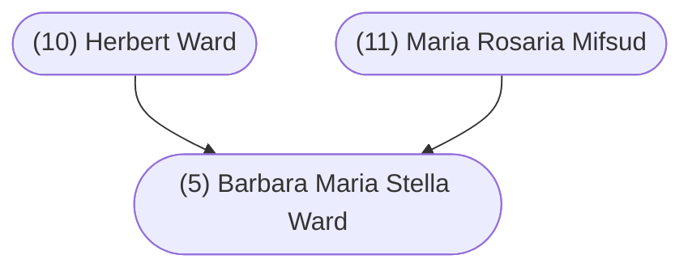

#### Summary

Barbara Maria Stella Ward was born on August 19, 1935 in Sliema, Malta to (10) Herbert Ward and (11) Maria Rosaria Mifsud.

Barbara was the first of three children. Barbara’s siblings were:

* Diana Dorothy Ward, born October 24, 1937
* Catherine Ward, born November 2, 1939

Barbara married [(4) Gerhard Wilhelm Stein](/4-gerhard-wilhelm-stein/) on June 17, 1961 in Calgary, Alberta, Canada.

Barbara died on May 1, 2017 in Calgary, Alberta, Canada and was buried in Calgary, Alberta, Canada.

 

#### Chart

