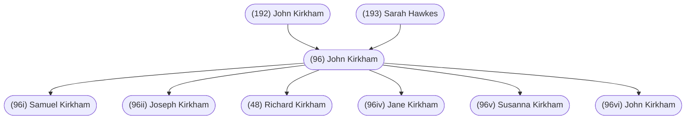

#### Summary

John Kirkham was born in 1800 in Wallbrook, Staffordshire, England to [[(192) John Kirkham]] and [[(193) Sarah Hawkes]].

It is unknown if John had any siblings.

John married [[(97) Ann Kinsey]] on May 13, 1825 in Sedgley, Staffordshire, England.

They had six children:

* [[(96i) Samuel Kirkham]], born 1826
* [[(96ii) Joseph Kirkham]], born 1830
* [[(48) Richard Kirkham]], born April 28, 1831
* [[(96iv) Jane Kirkham]], born 1836
* [[(96v) Susanna Kirkham]], born 1836
* [[(96vi) John Kirkham]], born 1838

John died on July 19, 1837 in unknown location and was buried in unknown cemetery.

 

#### Chart

 

#### Summary

*Written by [[(7) Lorraine Fitzpatrick]].*

John Kirkham, born in 1800, most likely in Wallbrook, Staffordshire, England, where his parents were married and where his father worked as a miner.

John  married [[(97) Ann Kinsey]] on May 13, 1825, at Sedgley, Staffordshire, England.  (It should be noted here that some records state Sedgley while others state Coseley.  Depending on where one may pick up the documentation, for the record, Coseley did not exist prior to 1847).

Their children:                       
* [[(96i) Samuel Kirkham]], born 1826, miner, lived in Walsall, Staffs.
* [[(96ii) Joseph Kirkham]], born 1830, miner
* [[(48) Richard Kirkham]], born April 28, 1831 - Gramp’s father
* [[(96iv) Jane Kirkham]], born 1836
* [[(96v) Susanna Kirkham]], born 1836, tailoress
* [[(96vi) John Kirkham]], born 1838, miner/stoker on train engine

John  was age 37 when he died July 19, 1837. His son John was born after his death.

In approximately 1840, Ann  married  Robert Purcell, when she was 33 years of age and Robert was 20 years of age. Together they had five children.

1861 CENSUS: Children of Ann and Robert Purcell
* Harriet, born 1842, servant
* Esther, born 1844, tailoress
* Robert, born 1846, millman
* Mary Ann, born 1847
* Jane, born 1850, scholar
