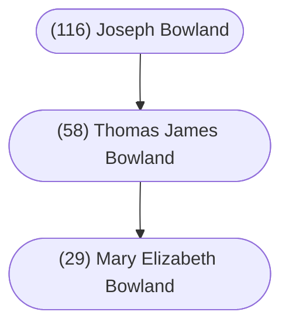

Most likely from Edward MacLysaght's [*Irish Families: Their Names, Arms, and Origins*](https://www.irishacademicpress.ie/product/the-surnames-of-ireland-6th-edition/) (Irish Academic Press, 1991):

> The older form of this name---O’Bolan---is almost obsolete, though it is occasionally found without the prefix O. The usual modern form---Boland---never has the O, though entitled to it, the Gaelic original being O Beollain.
>
> The addition of the D at the end of the name is an anglicized affectation comparable to changing -ahan into -ham, as in the case of Markham for Markahan. This final D does not once appear in the Elizabethan Fiants though the name in four different forms occurs nine times in those records, principally in Co. Sligo.
>
> There are at least two distinct septs of the name, one of the Ui Fiachrach line, seated at Doonaltan, (barony of Tireragh, Co. Sligo); the other being Dalcassian, of Thomond. The former may be distinct from that of Drumcliff, also in Co. Sligo, where O’Bolans were erenaghs of the church of St. Columban. The Thomond sept is descended from Mahon, brother of Brian Boru: for this we have the authority of “An Leabhar Muimhneach,” but MacFirbis traces them to another Mahon, less closely related to the great Brian.
>
> Present day representatives of these septs are chiefly found in north Connacht and in east Clare where the picturesque fishing village of Mountshannon on Lough Derg perpetuates the homeland of the sept in its Gaelic name Baile ui Beolain (or Ballybolan).
>
> In the seventeenth century it was also numerous in Offaly. References to the name O Beollain occur occasionally in the Annals in early mediaeval times, but since the Anglo-Norman invasion they have not been prominent in the political or cultural history of the country. Today Boland is a household word in the milling industry of Dublin, and is also prominent in the person of Frederick Boland, formerly Ambassador to Great Britain and later Ireland’s permanent representative in the United Nations Organization.

 

#### Chart

