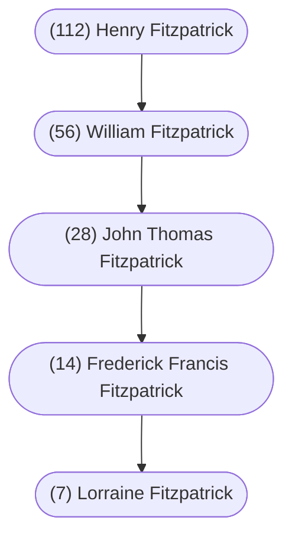

From Edward MacLysaght's [*Irish Families: Their Names, Arms, and Origins*](https://www.irishacademicpress.ie/product/the-surnames-of-ireland-6th-edition/) (Irish Academic Press, 1991):

> Fitzpatrick, Kilpatrick. This is the only surname with the prefix Fitz which is of native Irish origin, the others being Norman. The Fitzpatricks are Macgilpatricks---Mac Giolla Phadraig in Irish, meaning son of the servant or devotee of St. Patrick. In sixteenth and even seventeenth century records they are usually called MacGilpatrick or MacKilpatrick; and in some places they are still so called, other variants being McIlpatrick, Kilpatrick, etc.: the latter is common in Ulster, where, however, it is usually of Scottish origin. Their eponymous ancestor was Giolla Padraig, a warlike chief in Ossory who lived in the second half of the tenth century. Branches of the sept are now found in many parts of the country: nearly ten thousand persons of the name are estimated to be in Ireland today, widely distributed, Leix (alias Queen’s Co.) having the greatest number. By far the most important was, and still is, the family whose head was for centuries during the Gaelic period known as Lord of Upper Ossory, at one time almost a royal ruler over counties Leix and Kilkenny. Their power was much reduced by the rise of the Ormond Butlers, but they were by no means dispossessed of all their patrimony. They were one of the first of the great Irish septs to submit to Henry VIII and one Sir Barnaby Fitzpatrick was knighted in 1558. They lost considerably through their loyalty to James II. Nevertheless the head of the family received a peerage in 1714 and in 1878 his descendants are recorded as possessing no less than twenty-two thousand acres of the best land in Ossory.
>
> One branch of the Fitzpatricks of Ossory assumed the surname Mac Seartha, or Shera in English, taken from an ancestor whose christian name that was. Many variants of the name, in addition to those given above, are recorded in the modern birth registers, not only more or less obvious abbreviations like Fitz, Fitch and Patrick, but even Parrican, Parogan and Patchy!
>
> Brian Fitzpatrick (1585 - 1652), Vicar Apostolic of Ossory, who was murdered by Cromwellian soldiers, was instrumental in saving the “Book of the O’Byrnes,” which he transcribed, from destruction. In modern times, apart from the Earls of Upper Ossory, several Fitzpatricks were prominent in politics, two in the English interest and another Patrick Vincent Fitzpatrick (1792 - 1865) was one of Daniel O’Connell’s most trusted colleagues. Also worthy of mention are William John Fitzpatrick (1830 - 1895), the biographer, and Thomas Fitzpatrick (1832 - 1900), an eminent physician.
>
> Much information on the Fitzpatricks will be found in Corrigan's History of the Diocese of Ossory, Vol. I.

 

From book - “The Battle of the Boyne” (William of Orange)

> “After the time of the Normans integrated so completely they became ‘more Irish than the Irish’.
>
> FITZPATRICK was the scion of an old Norman Catholic family of that number who had originally conquered Ireland for the English in the 12th century.
>
> The old families, the Morrises, Fitzgeralds, Barrys, Roches, Burkes, Plunketts, Joyces, Fitzgibbons and Fitzhughs, fared better than the croppies down through the ages.  Before their integration they were the mighty “Earls of Ireland”.  As the Catholics emerged from their dark age, our non-Anglo middle and upper class was largely of Norman background.

 

And yet another description of the name (unknown source):

> FITZPATRICK. Despite its Norman appearance, ‘Fitz-‘ being Norman French for ‘son of’ , in the vast majority of cases Fitzpatrick is an anglicisation of the Irish Mac Giolla Phadraig, meaning ‘son of the servant of (St) Patrick’.  Similarly to other surnames containing Giolla, it has also been anglicised as ‘Kilpatrick’ and, more rarely, ‘Gilpatrick’, principally in Ulster, where it is most common in counties Fermanagh and Monaghan.  The original Giolla Phadraig from who the surname is taken was the tenth-century ruler of the ancient kingdom of Upper Ossory, including parts of the present counties of Laois and Kilkenny.  The surname was anglicized to Fitzpatrick in the early sixteenth century, when the chief of the family accepted the title of Lord Baron of Upper Ossory from Henry V111.  Partly due to this, they managed to retain possession of a large portion of their original lands right up to the nineteenth century.  Although the surname is now common and widespread throughout Ireland, the largest concentration is still to be found in Co. Laois, part of their original homeland.

 

#### Chart

 

#### d’Aboville

* 1 [[(112) Henry Fitzpatrick]]
	* 1.1 [[(56) William Fitzpatrick]]
		* 1.1.1 [[(28) John Thomas Fitzpatrick]]
			* 1.1.1.1 [[(28i) Jessie Maitland Fitzpatrick]]
				* 1.1.1.1.1 Audrey Florence Ashley
					* 1.1.1.1.1.1 Kathleen May Talerico
						* 1.1.1.1.1.1.1 Wesley Ian Dainard
							* 1.1.1.1.1.1.1.1 Jenelle Dainard
						* 1.1.1.1.1.1.2 Gordona Jean Dainard
						* 1.1.1.1.1.1.3 Philip Andrew Dainard
						* 1.1.1.1.1.1.4 Ivan William Dainard
					* 1.1.1.1.1.2 Clifford Gordon Talerico
						* 1.1.1.1.1.2.1 Gordon William Talerico
					* 1.1.1.1.1.3 Dorothy Marguerite Talerico
						* 1.1.1.1.1.3.1 Alvin Douglas Newell
							* 1.1.1.1.1.3.1.1 Kenneth Alvin Newell
						* 1.1.1.1.1.3.2 Barbara Ann Newell
						* 1.1.1.1.1.3.3 Hugh Gordon Newell
					* 1.1.1.1.1.4 Janet Elaine Talerico
						* 1.1.1.1.1.4.1 Cheryle Lee Schier
						* 1.1.1.1.1.4.2 Verne Richard Schier
					* 1.1.1.1.1.5 John Ashley (Jack) Talerico
					* 1.1.1.1.1.6 Vivian Faye Talerico
						* 1.1.1.1.1.6.1 Deanna Michelle Enns
						* 1.1.1.1.1.6.2 Michael Enns
						* 1.1.1.1.1.6.2.1 Stefan Michael Enns
						* 1.1.1.1.1.6.3 Natalie Daniella Enns
					* 1.1.1.1.1.7 Phylis Anne Talerico
						* 1.1.1.1.1.7.1 Randy Gordon Hrycewich
							* 1.1.1.1.1.7.1.1 Connor Riley Hrycewich
						* 1.1.1.1.1.7.2 Rhonda Hrycewich
							* 1.1.1.1.1.7.2.1 Drake Dakota Tomlin
					* 1.1.1.1.1.8 Timothy Allan Talerico
						* 1.1.1.1.1.8.1 Tommy Marie Talerico
						* 1.1.1.1.1.8.2 Jeffry Allan Talerico
							* 1.1.1.1.1.8.2.1 Cody Michael Talerico
						* 1.1.1.1.1.8.3 Stewart Talerico
						* 1.1.1.1.1.8.4 Michelle Talerico
					* 1.1.1.1.1.9 Ronald Ian Talerico
			* 1.1.1.2 [[(28ii) Annie Catherine Fitzpatrick]]
				* 1.1.1.2.1 Dorothy McNiece Fay
					* 1.1.1.2.1.1 Dale Mitchell
					* 1.1.1.2.1.2 Edward (Ted) Mitchell
					* 1.1.1.2.1.3 Madeline Mitchell
					* 1.1.1.2.1.4 Roselynn Chalmers
					* 1.1.1.2.1.5 Brent Chalmers
					* 1.1.1.2.1.6 Penny Chalmers
			* 1.1.1.3 [[(28iii) Mary Muriel Fitzpatrick]]
			* 1.1.1.4 [[(14) Frederick Francis Fitzpatrick]]
				* 1.1.1.4.1 [[(14i) Muriel Fern Fitzpatrick]]
					* 1.1.1.4.1.1 Dale Ernest Fitzpatrick
						* 1.1.1.4.1.1.1 Shelley Dawne Patterson
						* 1.1.1.4.1.1.2 Trisha Danielle Patterson
					* 1.1.1.4.1.2 Shari-Lynn Patterson
				* 1.1.1.4.2 [[(14ii) Everett Roy Fitzpatrick]]
					* 1.1.1.4.2.1 Gary Frederick Fitzpatrick
						* 1.1.1.4.2.1.1 Martin Everett Fitzpatrick
					* 1.1.1.4.2.2 Judy Vena Fitzpatrick
						* 1.1.1.4.2.2.1 Jason Derek Steele
						* 1.1.1.4.2.2.2 Mark Allen Steele
					* 1.1.1.4.2.3 Roy William Fitzpatrick
						* 1.1.1.4.2.3.1 Fallon Marie Fitzpatrick
					* 1.1.1.4.3 [[(7) Lorraine Fitzpatrick]]
			* 1.1.1.5 [[(28v) Gordon William Fitzpatrick]]
				* 1.1.1.5.1 William Gordon Fitzpatrick
					* 1.1.1.5.1.1 Susan Marie Fitzpatrick
						* 1.1.1.5.1.1.1 Michael Robert Burke
						* 1.1.1.5.1.1.2 Daniel Burke
					* 1.1.1.5.1.2 Brenda Fitzpatrick
					* 1.1.1.5.1.3 Colleen Fitzpatrick
				* 1.1.1.5.2 Harold John Fitzpatrick
					* 1.1.1.5.2.1 Shannon Fitzpatrick
						* 1.1.1.5.2.1.1 Christina Soares
						* 1.1.1.5.2.1.2 Erin Soares
					* 1.1.1.5.2.2 Penny Anne Fitzpatrick
						* 1.1.1.5.2.2.1 Justin Evans
							* 1.1.1.5.2.2.2 Jeremy Evans
			* 1.1.1.6 [[(28vi) Dorothy Jean Fitzpatrick]]
			* 1.1.1.7 [[(28vii) John Harold Fitzpatrick]]
				* 1.1.1.7.1 Delores Ann Fitzpatrick
					* 1.1.1.7.1.1 John Albert Pfeiffer
					* 1.1.1.7.1.2 Linda Ruth Pfeiffer
				* 1.1.1.7.2 Marilyn Ruth Fitzpatrick
					* 1.1.1.7.2.1 Donald Gordon Maxwell
						* 1.1.1.7.2.1.1 Donald William Maxwell
						* 1.1.1.7.2.1.2 Laura Mae Maxwell
						* 1.1.1.7.2.1.3 Megan Elizabeth Maxwell
					* 1.1.1.7.2.2 Robert Keith Maxwell
					* 1.1.1.7.2.3 Richard Andrew Maxwell
						* 1.1.1.7.2.3.1 Katelyn Christina Maxwell
						* 1.1.1.7.2.3.2 Alexander Nathaniel Maxwell
					* 1.1.1.7.2.4 Scott Douglas Maxwell
				* 1.1.1.7.3 Gayle Elizabeth Fitzpatrick
					* 1.1.1.7.3.1 Kelly Lee Maguire
					* 1.1.1.7.3.2 Kathryn Rose Maguire
						* 1.1.1.7.3.3 Kenneth L. Maguire
					* 1.1.1.7.3.4 Kristie May Maguire
				* 1.1.1.7.4 Jacqueline May Fitzpatrick
			* 1.1.1.8 [[(28viii) Audrey Heloise Fitzpatrick]
				* 1.1.1.8.1 Vivian Fay Handren
					* 1.1.1.8.1.1 Curtis E. Duncan
					* 1.1.1.8.1.2 H. Scott Duncan
		* 1.1.2 [[(56ii) Martha Fitzpatrick]]
		* 1.1.3 [[(56iii) Johannah Fitzpatrick]]
		* 1.1.4 [[(56iv) William Louis Fitzpatrick]]
			* 1.1.4.1 Helen Fitzpatrick
				* 1.1.4.1.1 Charles Reid
				* 1.1.4.1.2 Paul B. Reid
					* 1.1.4.1.2.1 Bruce Reid
					* 1.1.4.1.2.2 Helen Reid
					* 1.1.4.1.2.3 Jennifer Reid
					* 1.1.4.1.2.4 Jeffrey Reid
					* 1.1.4.1.2.5 Jacqueline Reid
				* 1.1.4.1.3 John J. Reid
					* 1.1.4.1.3.1 Deborah Reid
					* 1.1.4.1.3.2 John Reid, Jr.
				* 1.1.4.1.4 William L. Reid
					* 1.1.4.1.4.1 Gregory Reid
					* 1.1.4.1.4.2 Kimberly Reid
					* 1.1.4.1.4.3 Kristan Reid
				* 1.1.4.1.5 Raymond G. Reid
			* 1.1.4.2 Doris Evelyn Bernice Fitzpatrick
				* 1.1.4.2.1 Charles Dickinson Marks
				* 1.1.4.2.2 Donna Corrine Marks
					* 1.1.4.2.2.1 Mark Plummer Era
					* 1.1.4.2.2.2 Lesley Denise Era
					* 1.1.4.2.2.3 Lisa Corrine Era
		* 1.1.5 [[(56v) Charles Fitzpatrick]]
		* 1.1.6 [[(56vi) Michael Fitzpatrick]]
		* 1.1.7 [[(56vii) Robert A. Fitzpatrick]]
