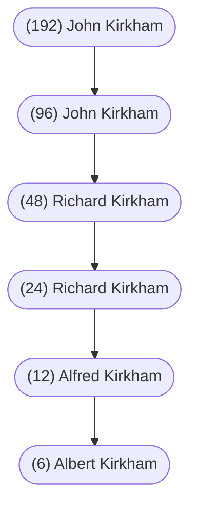

#### Kirkham Name

The following from Billy Kirkham’s research files (see [[Kirkham Introductory Note]]):

Whence and when did the name of KIRKHAM come in to use?

Attention is drawn to the place known in the time of Domesday Records “Great Inquisition of Lands of England” initiated by William the Conqueror in 1086 as CHERCAM - (in English, KIRKHAM).

This place ‘Chercam’ being subject to ‘Danelaw’, an imposed tax for the protection against Viking invasion, at the time of their occupation of the N.E. part of England - east of Watling Street, - ceded to them under the Treaty of Wedmore A.D. 878.

Chercam was part of the fee of Knight’s (of which there were thirty in all) awarded to Count William of Montain.

As a result of Count William’s part in the plotting of Count Robert of Normandy against the Conqueror - The English fief, each having a fee of thirty Knight’s - was forfeited - part in favour of a Walter l’ Espec.  Walter l’ Espec had five Knight fees which included those of Chercam and Helsmley, being the chief Manors.  (Manors - of Anglo Saxon origin) Year 1066.

In 1086 - The Danegeld was revalued and the tax imposed was reduced to cover eight ‘carucates’.  A carucate being ‘as much land that a team could plough in one year’.

Walteu - ‘Waltheof’ - Walter l’ Espec - had a Chercam - One Manor, One Mill, One Church with One Priest.

In 1122 - 1130, Walter gave land to the Augustinian Order of ‘Black Canons’, land on which to build a monastic dwelling place - later to become the **PRIORY OF KIRKHAM**.

The first Prior was William, Rector of Garton, uncle of the founder - Walter de l’Espec.

Walter was impressed by the Cistercian Order and transferred his favour to this Order and the Abbey at Revaulx, where he resided.

The generations following Walter - The Lord’s Helmsley were buried at Kirkham Priory, so it would appear that there was a much continued interest in the Priory.

* William de Roos dying in 1258
* Robert, first Lord Ros of Helmsley, dying in 1285
* William, second Lord Ros of Helmsley, dying in 1316
* William, third Lord Ros of Helmsley, dying in 1343

Chercam at East Riding of Yorkshire must not be confused with the Lancashire place of Chicheham (icll) - this would be spelt, it is believed, KIRKEHAM.

It would seem that the generation of KIRKHAM commenced at WOMBOUNE and LOWER PENN in 1539 when the name appeared on the munster roll.  Then in 1585, records commence with Henry and Alis.

The History of Walter de KIRKHAM (Chercam) born of humble parentage in the year --?

Died in 1260 A.D. at Howden and buried at DURHAM CATHEDRAL.

* 1225 ---  Royal Clerk (Clerk of the Wardrobe - King Henry 1st)
* 1225 ---  Chaplain - Eastrington, Yorkshire
* 1226 ---  Dean - Pencric, Staffordshire (Penkridge)
* 1229 ---  Dean - St. Martin’s Le Grand, London - October 10th; Prebend - Bole of Yorkshire (stipend in Cathedral Church)
* 1232  ---  Archdeacon of Salopshire
* 1241 ---  Dean of York
* 1249 to 1260  Bishop of Durham - Appointed Bishop April 21st, 1249 on the resignation of Nicholas de Farmham. The Royal nominee was “Aymer” and it was not until the date of Sept. 27th, 1249 that King Henry 1st gave consent to the appointment. Walter de Kirkham was not therefore consecrated until the date of Dec. 5th, 1249. Consecration took place at York.
* 1257 ---  Visited Stirling Castle in Scotland on State Affairs
* 1258 ---  He had a quarrel with King Henry 1st and refused to “Come to Court”!
* 1260 ---  He died at a great age on August 9th
* NOTE ---  It would appear, as history informs such, that this Bishop de Kirkham was to be reprimanded by the King for having the affrontary to excommunicate some of the staff of the lordly Scotman John de Baliol (1249 - 1315). John de Baliol was claimant to the Scottish throne in 1290 and much favoured then by Edward 1 of England.

Could it be that this pious dominant man shed his seed in Scotland - Shropshire - Staffordshire during his travels?

Simcoh de KIRKHAM --- York 1214 - (no history yet)

 

#### Kirkham Priory

YORKSHIRE

The following from Billy Kirkham’s research files:

Ministry of Public Building and Works: Ancient Monuments and Historic Buildings. by the late Former Chief Inspector of Ancient Monuments APLES PEERS, C.B.E., F.H.A., F.S.A.

 

##### History

**KIRKHAM** was founded as a house of Augustinian or Black Canons by Walter l’ Espec between 1122 and 1130, the first of three monastic houses to be founded by him.  The other two were Cistercian, Rievaulx in 1131 and Warden (in Bedfordshire) in 1136.

 The first Prior of Kirkham was William, rector of Garton, uncle to the founder.  The early history of the house is notable for what seems to have been the desire of a considerable number of the canons to join the Cistercian Order, apparently under the auspices of Rievaulx Abbey.  If as seems likely, this matter took place during the life of the founder, his interest in the Cistercians, as founder of two houses of that Order, may have had something to do with it.

 A document printed in the Carulary of Rievaulx published by the Surtees Society, No. CXLIX, page 108, sets forth an agreement made between some of the canons of Kirkham and the monks of Rievaulx, in which these canons, as distinct from the Prior of Kirkham and     the rest of the canons, were to be provided with new monastic buildings, of a temporary nature, at Linton, and were to take with them from Kirkham all moveable things, crosses, chalices, books, vestments, etc. and even the stained glass windows, in place of which they were to put windows of white glass.  They were to leave at Kirkham one bell, whichever they pleased, and they could take away all domestic utensils which they wanted.  They would not leave Kirkham till a final agreement had been arranged, and if they had gone before the end of a year, were to retain all revenues which would fall due to them until a full year had expired.  Finally, all canons and brothers of Kirkham living at the time were to have the same treatment in the Chapter and Order of Citeaux as a monk of that Order.  What actually happened as result of this agreement, we do not know:  Kirkham at any rate remained an Augustinian priory to the end.

The interpretation of the agreement seems to be that Kirkham Priory was to become a Cistercian house, and that the canons who wished to remain in the Augustinian Order should go elsewhere to a new monastery to be built at Linton.

Just as the church at Rievaulx was greatly enlarged in the first half of the thirteenth century by a rebuilding starting from the east, so did it happen at Kirkham.  The great new presbytery and choir was completed about the middle of the century, and for a few generations became the favourite burying-place of the founders, the Lords of Helmsley, William de Roos, dying in 1258, was buried in the middle of the presbytery in from the high altar;  Robert, first Lord Ros of Helmsley, in a marble tomb on the south side (1285);  William, second Lord Ros, similarly on the north side (1316), and his successor William, third Lord, in a marble monument next the high altar on the south side (1343).  After this no more burials at Kirkham are recorded.

Like many other houses, Kirkham was heavily in debt by the end of the thirteenth century, owing over one thousand pounds, and the story of the buildings makes it clear how much of the debt must have accumulated.  To raise money, the sale of corrodies - or life-pensions to individuals - was freely resorted to sixteen having been granted in the early years of the fourteenth century.  There were a prior and sixteen canons in 1380, and practically the same number at the Suppression in 1539.  The revenue in the sixteenth century was two hundred and sixty-nine pounds.

 

##### Description

The monastic precinct is entered from the north through the GATEHOUSE.  This is of late thirteenth century date and has a wide gatehall with ranges of buildings to east and west.  The north front is a very attractive composition enriched with heraldry and figure sculpture.  The wide arch of the gateway is enclosed by a gables crocketed label, enclosing a trefoiled niche which once held a carving of the Crucifixion, and having on either side groups of sculpture under small canopies - on the east side St. George and the Dragon, on the west David and Goliath.  Above each group is a pair of shields, the eastern pair having the arms of Scrope and de Roos, the western pair de Roos and de Fortibus.  In the upper stage are two windows with geometrical tracery, and between them a seated figure of Christ in a vesica, with figures of St. Philip and St. Bartholomew below in trefoiled niches.  The windows have panelled sills, and flanking them are two shields, one with the arms assigned to l’Espec, the other Fitz-Ralph.  Gabled and crocketed labels surmount the windows and the spaces on either side of them, and between the gables are shields with the arms of de Clare, England, de Roos and Vaux.  The facade is bounded by buttresses, which were carried up as pinnacles.  The front is finished with a panelled parapet, below which is the uncommon feature of a line of early thirteenth-century leafwork re-used by the builders of the gate.

From the gatehouse the outer court of the Priory extends as a wide expanse of grass, without traces of buildings up to the entrance to the church, which for seculars would be by the north door of the nave.

The first CHURCH was a plain aisleless cruciform building with walls 4 feet thick, and 33 feet wide within the walls.  The square-ended presbytery was 44 feet long, the transepts about 40 feet deep, and the nave 83 feet long, with the cloister on its south side:  the total length over all about 180 feet.  Of this church the south wall of the nave, parts of the west and south walls of the south transept, and the plinth course of the north-east pier of the crossing are still to be seen.  This church was rebuilt about 1180, the thickness of the walls being increased to 6 feet, but the external width remained the same as before, so that the internal span was reduced to 29 feet.  The additions to the thickness of the south wall of the nave and the west wall of the south transept are clearly to be seen, but the north wall of the nave, the whole of the north transept and the presbytery, and the east and part of the south wall of the south transept were entirely rebuilt.  This church when complete was almost exactly 200 feet long inside from the east wall of the presbytery to the west wall of the nave, and with the slight lengthening of both nave and presbytery and the addition of western towers, was some 140 feet over all from east to west by 133 from north to south.  In the first quarter of the thirteenth century a great scheme of enlargement, which would have amounted to rebuilding if carried to completion, was begun from the east.  A new choir and presbytery of eight bays, 125 feet long, with north and south aisles, replaced the twelfth-century aisleless presbytery.  It ended westward in two piers intended to carry the eastern arch of a new central tower, slightly to the east of the existing crossing.  This tower was never built, but if it had been, the transepts and in consequence the east wall of the cloister would have been moved proportionately eastwards, and in anticipation of this chapter house was rebuilt with its west wall 8 feet to the east of the line of the cloister.  There the scheme stopped, doubtless for want of money, and the twelfth-century transepts and nave of the church remained as they were till the Suppression.

What can now be seen amounts to little more than a ground plan.  At the east end of the church a block of fine thirteenth-century detail shows what the east front was like, and the north and south arcades of the presbytery.  The eastern bay, which is narrower than the rest,  was occupied by a platform on which three, or perhaps five, altars stood, as at Rievaulx.  The second bay was an ambulatory, and in the third stood the high altar set against a stone screen.  There are remains of tombs between the arcades on the south side of the presbytery, and a few gravestones remain in the aisles.  The records of the burial places of the Lords of Helmsley, already quoted, may identify the two graves on the south side of the presbytery with those of William de Roos, 1343, and Robert de Roos, 1285.

The stalls of the choir of the canons must have occupied several bays, probably from the fifth bay westward, but nothing of them remains.  Across the main space can be seen the lines of the foundations of the east ends of the two twelfth-century churches, and of the later (1180) church parts of the plinth exist.  A chapel of two bays was added in the fourteenth century outside the south aisle, and its altar platform and the base of its altar remain.

The north transept is part of the late twelfth-century building, and is of two bays with eastern chapels.  The northern of these was converted to the east of the transept.  In the west wall of the transept is a narrow, crooked passage leading to the nave west of the line of the twelfth-century pulpitum.  The wall of the passage has been broken through to provide access to a room built against the west side of the transept.  This was a living-room some 18 feet long, and perhaps intended for the sacrist; it was doubled in length at a later date and a garderobe constructed in its north wall.  Other rooms were built against the north wall of the transept, probably very late in the history of the Priory; the remains of a small oven can be seen in the angle of the transept wall.  The crossing shows the remains of the four piers of the late twelfth-century tower, and embedded in the north-east pier, the base of a corresponding pier of the earlier twelfth-century church, the walls of which were 3 feet thick.  The south transept has eastern chapels of late twelfth-century date, but in its south and west walls retains much of the older walls, 4 feet thick.  There is a late twelfth-century door in its west wall to the cloister, as usual in monastic churches which have no aisles to the nave.

The nave retains little architectural detail except at the west end.  The south-east doorway to the cloister belongs to the first twelfth-century church, and the thickening of the south wall late in the century clearly shows here.  The south-west doorway to the cloister is all of the later date, but remains of the earlier doorway appear in the wall.  When the nave was lengthened, c. 1180, two western towers were added, with a vestibule between them, apparently outside the west wall of the nave.  The rapid fall of the ground here made a series of plinth-courses necessary, but it seems that there was no west door to the nave, the entrance from the courtyard being in the north wall, opposite the door to the cloister.  A wide vaulted entry under the south-west tower served as an outer parlour to the cloister, and above this remains of the tower exist for some 20 feet, but of the north-west tower nothing is left.

Though the MONASTIC BUILDINGS are much ruined, it has been possible by excavation to obtain a nearly complete plan of the whole group.  The cloister is 96 feet wide from east to west by 114 from north to south.  If, as was customary, it was at first set out as a square, all traces of the original south wall have perished.  On the east side, next to the transept, is a passage through the eastern range, belonging to the first lay-out, its eastern wall being on the line of that of the first dormitory, the traces of which may be seen further to the south.  Immediately south of the passage is an irregular space, bounded on the south by the thirteenth-century chapter house:  it must represent part of the site of the twelfth-century chapter house.  Its thirteenth-century successor must have been a fine building of four bays, probably vaulted, and with wall arcades all round the interior, standing on a stone benching: the late thirteenth-century range of building which joins it at an angle on the south, and runs southward some 140 feet, contained on its upper floor the dormitory, which did not, as usual, adjoin the transept, but was reached from the south-east corner of the cloister.  Owing to the southward fall of the ground, there was a vaulted basement beneath the south end of the range, and at right angles to it on the south a tall two-storeyed building containing the reredorter.  It seems to be rather earlier in date than the dormitory range, and at first stood free:  It must, therefore, have been reached by a bridge, but the dormitory was built up to it before its upper works were completed, as the masonry is bonded in above a certain height.  There were originally two doors to the reredorter from the dormitory, one for entrance, one for egress, with a niche between them:  but at a later date the flue of a fireplace made in the basement of the range was carried up through one doorway, effectually blocking it.  The ground storey of the reredorter was a fine vaulted room with a fireplace, and may have been used, as it certainly was in other monasteries, as an infirmary for the novices.

On the other side of the cloister is the frater or refectory, standing over a vaulted basement.  It is of thirteenth-century date, and must have been a fine room some 85 feet long, entered from the cloisters by a doorway of twelfth-century work, re-used.  Close to the doorway a winding staircase leads down to the basement and next to it in the west wall of the cloister is the frater lavatory, a beautiful late thirteenth-century composition, now lacking the leaded water troughs where the canons washed their hands before entering the frater.  To the east of the frater is a passage leading through the range southwards, and at the south-west angle of the frater the ruins of the monastic kitchen with several fireplaces, and a large oven.  Immediately south of it is a large building, originally of two stories, which has been a guest house.

The western range of the cloister, except for the outlines of vaulting on its east wall, has entirely disappeared, and it is possible that it was never actually built.

To the east of the dormitory are extensive remains of buildings, which are essentially the infirmary and the Prior’s house.  The infirmary hall, of five bays with north and south aisles, was of thirteenth-century date, and had a porch entry on the east, and at its north end a block which was probably the house of the Infirmarer.  At its south end were offices and a kitchen, which also served the Prior’s house.  The Prior’s house had a hall, a solar and a garderobe, and next to it, adjoining the infirmary and its kitchen, a second hall which was doubtless the misericorde or dining-hall of the infirmary and of the Prior’s guests, where the regulations for food as served in the refectory were relaxed, and a more generous diet provided.

The water supply of the Priory must have come from the high ground to the east:  a water channel exists from the south end of the infirmary, running by the Prior’s house and the reredorter;  there was doubtless a supply of the frater, lavatory and the kitchen by lead pipes which have now been taken away.

_Crown Copyright reserved_

Printed in England by Fosh & Cross Ltd., London and published by Her Majesty’s Stationery Office:  1946

Sixpence net   _Reprinted_ 1963

 

#### Chart

